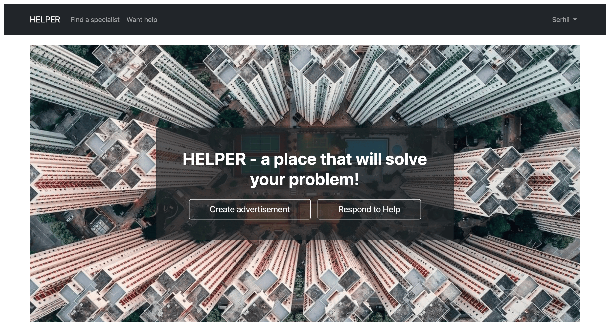

# 📝 Helper

A Django web application that allows users to create and browse advertisements for help in various areas (household work, repairs, technical tasks, etc.).  
Registered users can:
- create their own ads with price and description;
- respond to other users’ ads;
- leave reviews and ratings for other users;
- communicate through a built-in messaging system (planned).

---

## 🚀 Core Features
- **Registration and authentication** with unique email and user profile.  
- **User profile**:  
  - additional information (phone, specialization categories);  
  - list of created ads;  
  - average rating and reviews.  
- **Advertisements (Advertisement)**:  
  - create/edit/delete ads from the personal dashboard;  
  - categories and **search/sorting**;  
  - statuses (active, pending, completed).  
- **Reviews and ratings (Rating)**:  
  - numeric rating ⭐ (1–5);  
  - comments from other users;  
  - average rating displayed in the profile.  
- **Applications for ads (Application)**:  
  - users can apply to complete an ad;  
  - the ad’s author chooses the executor;  
  - the ad status changes to `Pending`;  
  - after completion, the author confirms it.  

---

## 🛠️ Technologies Used
- **Backend**: Django (CBV, Django ORM, LoginRequiredMixin, FormView, ListView).  
- **Frontend**: Django Templates + Bootstrap 5.  
- **Database**: SQLite (for dev), with PostgreSQL support.  

---

## 📂 Models
### 👤 User
Default Django user model.

### 📄 Profile
Additional user information:  
- phone number;  
- categories (`ManyToMany` with `Category`).  

### 📢 Advertisement
User advertisements for help:  
- title, description, price;  
- location, categories;  
- status (Active, Pending, Done).  

### ⭐ Rating
User reviews and ratings:  
- numeric rating (1–5);  
- comment;  
- user who left the review.  

### 🏷️ Category
Categories for both profiles and advertisements (e.g., repair, cleaning, electrical work).  

### 📩 Application
Applications for advertisements:  
- users can submit applications;  
- the author selects an executor;  
- ad status is updated.  

---

## 📌 Roadmap
- ✅ Implemented: search and sorting for ads.  
- ⏳ Planned: built-in messaging system between users.
---
## Demo



---
## ▶️ How to Run
```bash
# Clone repository
git clone https://github.com/your-repo/board-app.git
cd board-app

# Create virtual environment
python -m venv venv
source venv/bin/activate  # Linux/Mac
venv\Scripts\activate     # Windows

# Install dependencies
pip install -r requirements.txt

# Apply migrations
python manage.py migrate

# Create superuser
python manage.py createsuperuser

# Run development server
python manage.py runserver

#Host name - https://helper-3psn.onrender.com

